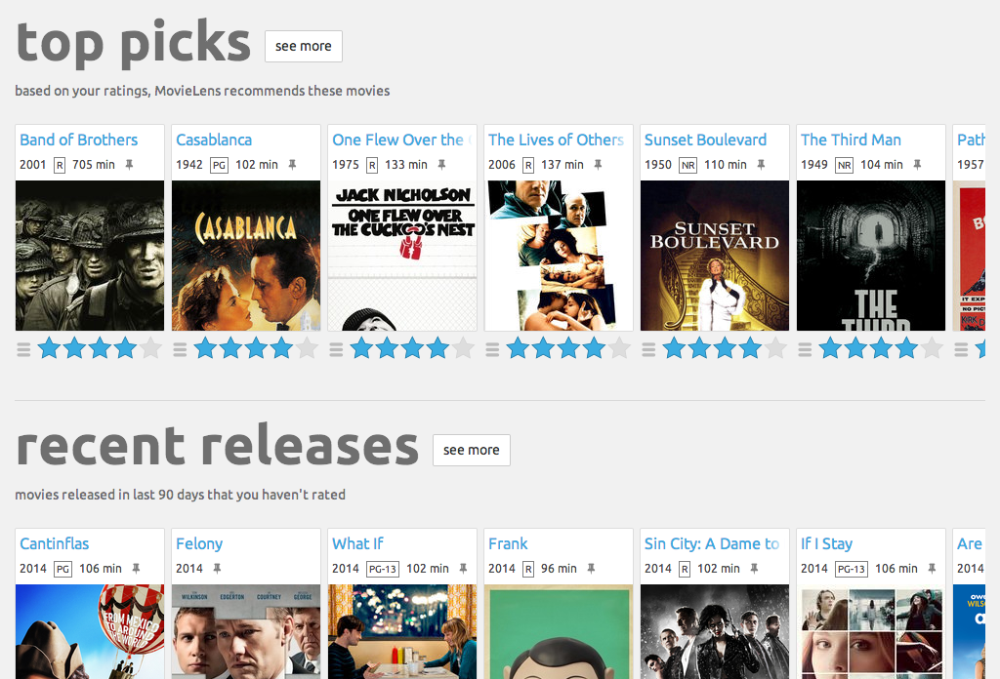

# ***ADM-HW4***  

## Group 20 members
1. Nurbek Khalmatay, 2184569, khalmatay.2184569@studenti.uniroma1.it
2. Simone
3. Amir
---



Welcome to the **ADM-HW4** project! This repository contains the solution to the Homework 4 assignment for the ADM course at Sapienza University of Rome. 

---
## Note to TA's and reviewers!!!
Due to the fact that there were two of us (the third person disappeared), TA extended the deadline until Wednesday 23.59.


---

## 🔍 **Overview**
This project involves developing and analyzing a **Movie Recommendation System** utilizing the MovieLens dataset. The primary objectives are to explore user preferences, enhance data retrieval efficiency using hashing techniques, and implement clustering algorithms to improve movie recommendations. The homework is structured into several tasks, focusing on data preparation, algorithm development, and model evaluation.


--- 


## 📂 **Files and Resources**

1. **`main.ipynb`**  
   This notebook contains the complete solution to the questions and tasks assigned in this homework.  

2. **Resources and Data**  
```
├── data/
│   ├── movie.csv
│   ├── rating.csv
│   ├── tag.csv
│   ├── genome_scores.csv
│   ├── genome_tags.csv
│   ├── link.csv
```
3. **Structure**
Below is the structure of the project directory:

```plaintext
ADM-HW3/

├── .gitignore                  # Files to be ignored by Git
├── LICENSE                     # Project license information
├── functions.py                # Helper functions
├── main.ipynb                  # Jupyter notebook with homework solutions
├── README.md                   # Project README file
├── requirements.txt            # Required Python libraries
````

---

## 📖 **How to Use**

1. Clone the repository to your local machine using:  
   ```bash
   git clone https://github.com/khalmatay/ADM-HW4.git
   ```
   
2. Install Dependencies

```bash
   export env_name="ADM-HW4"
   
   conda create -n $env_name python=3.10
   
   conda activate $env_name
   
   conda install --file requirements.txt
```
## Key Objectives

### Recommendation system with LSH

- implement a locality-sensitive hashing (lsh) algorithm for user-based movie recommendations.
- develop a minhash function to identify users with similar preferences.
- generate personalized movie recommendations by clustering users into buckets based on hashed signatures.

### Movie clustering

- perform feature engineering to represent movies effectively.
- utilize clustering algorithms (k-means, k-means++, and others) to group movies based on similarities.
- explore methods for determining the optimal number of clusters and compare clustering algorithm performance.

### AQ

- solve an algorithmic problem to predict outcomes in a two-player number game using optimal strategies.
- implement recursive and optimized versions of the solution and analyze their time complexity.


